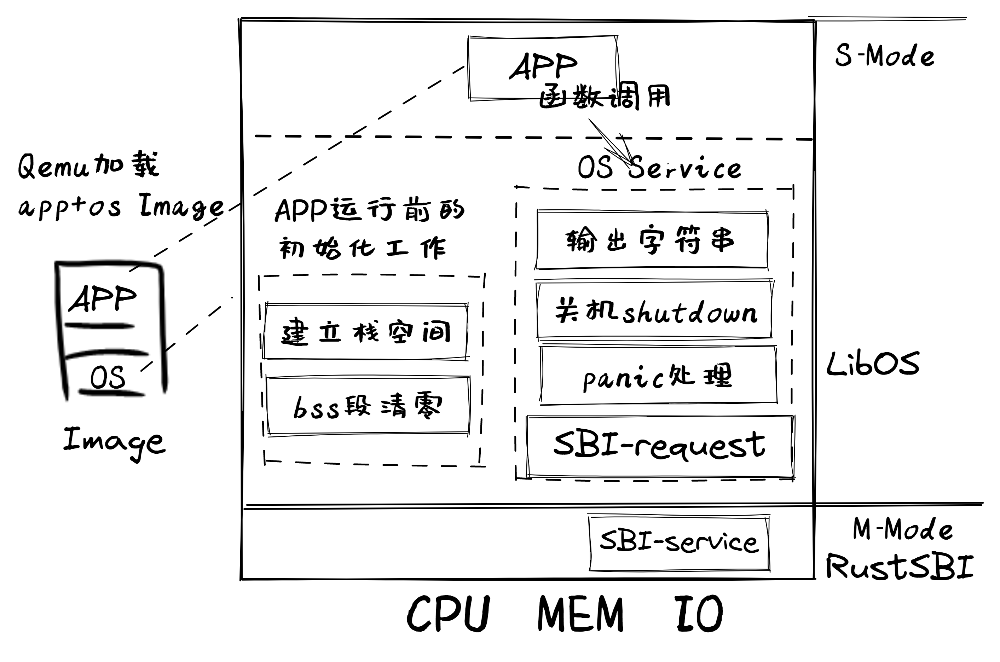

# 手写操作系统：
参考：http://rcore-os.cn/rCore-Tutorial-Book-v3/chapter1/0intro.html

清华大学操作系统课程 https://github.com/kiukotsu/ucore
基于树莓派写操作系统 https://github.com/isometimes/rpi4-osdev

视频课程：https://www.youtube.com/playlist?list=PLHh55M_Kq4OApWScZyPl5HhgsTJS9MZ6M

## Step1: 实现应用与硬件的分离
