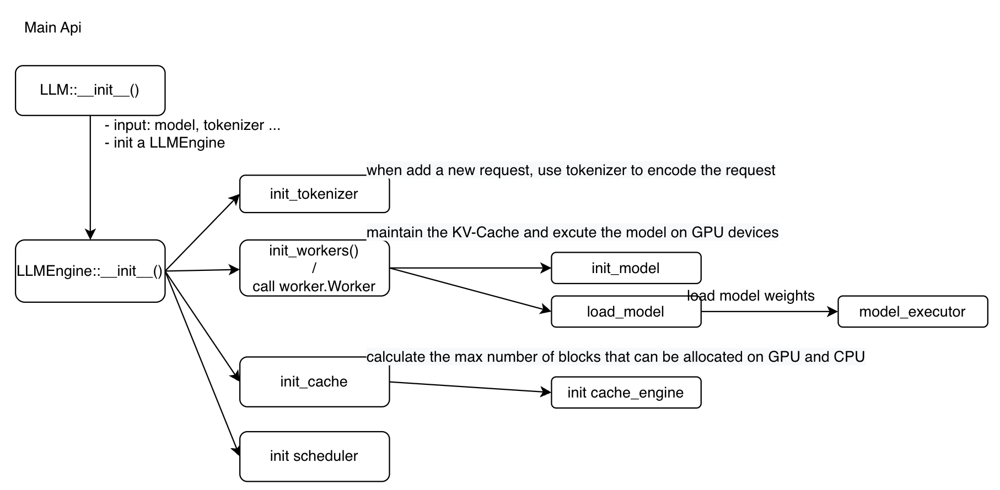
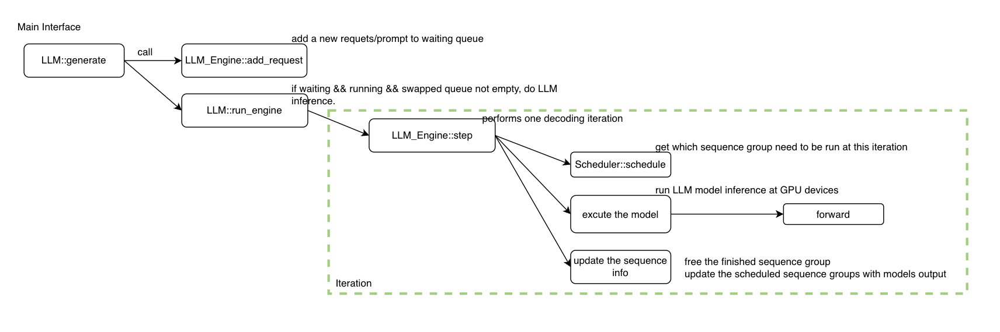
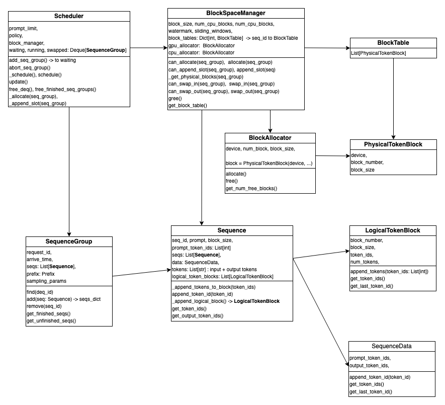
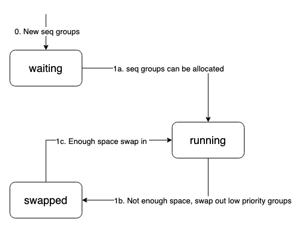

# vLLM Source Code
- Link: https://github.com/vllm-project/vllm
- Edition: v0.2.3
  - The hardware environment is A10, only support cuda 11.2
  - based Python 3.10

### Sample
```python
# like : examples/offline_inference.py
llm = LLM(model='/model_path')
sampling_params = SamplingParams(temperature=0.95, top_p=0.7, top_k=40, max_tokens=2048)
outputs = llm.generate(prompts, sampling_params)
```

### vLLM Initialization
- Structure 


- Main Inferface: vllm/entrypoints/llm.py
```python
class LLM:
    # initialization, insert model_config, tokenizer, quantization, and so on 
    # intial a new LLM_Engine to support further execution
    def __init__(model, ...):
        # initial a new llm_engine based on config
        self.llm_engine = LLMEngine.from_engine_args(engine_args)
        # engine: vllm/engine/llm_engine.py
        
        # Input Parameters 
        """
        Args:
            model: The name or path of a HuggingFace Transformers model.
            tokenizer: The name or path of a HuggingFace Transformers tokenizer.
            tokenizer_mode: The tokenizer mode. "auto" will use the fast tokenizer
                if available, and "slow" will always use the slow tokenizer.
            trust_remote_code: Trust remote code (e.g., from HuggingFace) when
                downloading the model and tokenizer.
            tensor_parallel_size: The number of GPUs to use for distributed
                execution with tensor parallelism.
            dtype: The data type for the model weights and activations. Currently,
                we support `float32`, `float16`, and `bfloat16`. If `auto`, we use
                the `torch_dtype` attribute specified in the model config file.
                However, if the `torch_dtype` in the config is `float32`, we will
                use `float16` instead.
            quantization: The method used to quantize the model weights. Currently,
                we support "awq". If None, we assume the model weights are not
                quantized and use `dtype` to determine the data type of the weights.
            revision: The specific model version to use. It can be a branch name,
                a tag name, or a commit id.
            tokenizer_revision: The specific tokenizer version to use. It can be a
                branch name, a tag name, or a commit id.
            seed: The seed to initialize the random number generator for sampling.
            gpu_memory_utilization: The ratio (between 0 and 1) of GPU memory to
                reserve for the model weights, activations, and KV cache. Higher
                values will increase the KV cache size and thus improve the model's
                throughput. However, if the value is too high, it may cause out-of-
                memory (OOM) errors.
            swap_space: The size (GiB) of CPU memory per GPU to use as swap space.
                This can be used for temporarily storing the states of the requests
                when their `best_of` sampling parameters are larger than 1. If all
                requests will have `best_of=1`, you can safely set this to 0.
                Otherwise, too small values may cause out-of-memory (OOM) errors.
    """
```

- LLMEngine: vllm/engine/llm_engine.py
```python
# An LLM engine that receives requests and generates texts.
class LLMEngine:
    def __init__(self, model_config, ... ...):
        self.tokenizer = get_tokenizer(...)  # from config
        # Create the parallel GPU workers
        # Ray - a opensource framework for distributed computing
        if self.parallel_config.worker_use_ray:
            # allowing Worker to be lazliy initialized after Ray sets CUDA_VISIBLE_DEVICES
            self._init_workers_ray(placement_group)
        else:
            self._init_workers(distributed_init_method)
        # Profile the memory usage and initialize the cache.
        # calculate how many blocks can be allocated on GPU and CPU devices. and initial 
        # the cache_engine
        self._init_cache()

        # Create the scheduler.
        self.scheduler = Scheduler(scheduler_config, cache_config)

    def from_engine_args(cls, engine_args: EngineArgs) -> "LLMEngine":
        """
        Creates an LLM engine from the engine arguments."
        Note:
            在Python中，cls代表的事类本身，self对应的则是类的一个实例对象；
            =>
                因为cls等同于类本身，类方法中可以通过使用cls来实例化一个对象
        """
        ... ...
        # return a llm_engine
        return cls(*engine_configs, ...)
    
    # takes the single GPU Device function as exsample
    def _init_workers():
        # Lazy import the Worker to avoid importing torch.cuda/xformers before CUDA_VISIBLE_DEVICES is set in the Worker
        from vllm.worker.worker import Worker
        self.workers: List[Worker] = []
        worker = Worker(
            self.model_config,
            self.parallel_config,
            self.scheduler_config,
            0,                      # stable GPU 0 - logical GPU ID 0
            distributed_init_method,
        )
        self.workers.append(worker)
        # initial model
        self._run_workers(
            "init_model",
            get_all_outputs=True,
        )
        # load weights from model files
        self._run_workers(
            "load_model",
            get_all_outputs=True,
            max_concurrent_workers=self.parallel_config.
            max_parallel_loading_workers,
        )

    def _init_cache():
        # Profiles the memory usage and initializes the KV cache.
        # Get the maximum number of blocks that can be allocated on GPU and CPU.
        # Run a forward inference with prompt lenth equal to the max_model_len (the longest inserted prompt is supported by the model), and get the peak memory.
        # Then, use peak memory to calculate how many blocks can be allocated on GPU and CPU.
        num_blocks = Worker.profile_num_available_blocks(
            block_size,
            gpu_memory_utilization,
            cpu_swap_space
        )
        # Since we use a shared centralized controller, we take the minimum
        # number of blocks across all workers to make sure all the memory
        # operators can be applied to all workers.
        self.cache_config.num_gpu_blocks = min(b[0] for b in num_blocks)
        self.cache_config.num_cpu_blocks = min(b[1] for b in num_blocks)
       
        # Initialize the cache.
        Worker.init_cache_engine(cache_config=self.cache_config)
```

- Worker: vllm/worker/worker.py
```python
# A worker class that executes (a partition of) the model on a GPU.
class Worker:
    def __init__(self, ...):
        # vllm/worker/model_runner.py
        # the real executed function
        self.model_runner = ModelRunner(model_config, parallel_config, scheduler_config)
    
    def profile_num_available_blocks():
        torch.cuda.empty_cache()
        torch.cuda.reset_peak_memory_stats()

        # forward execution for LLM models: execute model with max num sequences and the total number of tokens equal to max_num_batched_tokens dummy input data 0
        self.model_runner.profile_run()

        # caculate home many blocks can be allocated on GPU and CPU
        num_gpu_blocks = int(
            (total_gpu_memory * gpu_memory_utilization - peak_memory) //
            cache_block_size)
        num_cpu_blocks = int(cpu_swap_space // cache_block_size)
        num_gpu_blocks = max(num_gpu_blocks, 0)
        num_cpu_blocks = max(num_cpu_blocks, 0)
        
        # release the GPU memory
        torch.cuda.empty_cache()
    
    def init_model(self):
        # set device
        torch.cuda.set_device(self.device)

        # check dtype
        # Now support fp32, fp16 和 bfp16
        _check_if_gpu_supports_dtype(self.model_config.dtype)

        # initial distributed environment
        _init_distributed_environment(self.parallel_config, self.rank,
                                      self.distributed_init_method)
        # call torch.distributed.init_process_group(), use nccl to do the data communication

    def load_model(self):
        """
        in model_runner.py call "from vllm.model_executor import get_model"
        
        self.model = get_model(self.model.config)

        the model code is from: vllm/model_executor/model_loader.py
        Now, vllm support the following LLM models:
            can be find here: https://github.com/vllm-project/vllm

        # actually, it called the model.load_weights() function from Pytorch
        """
        self.model_runner.load_model()
```

### LLM Inference(模型推理)
- Structure

- LLM: vllm/entrypoints/llm.py
```python
class LLM:
    # the external interface，insert a list of prompts, got the answer from GPU
    def generate(self, prompts, sampling_params, prompt_token_ids, use_tqdm):
        """
        Args:
            prompts: A list of prompts to generate completions for.
            sampling_params: The sampling parameters for text generation. If
                None, we use the default sampling parameters.
            prompt_token_ids: A list of token IDs for the prompts. If None, we
                use the tokenizer to convert the prompts to token IDs.
            use_tqdm: Whether to use tqdm to display the progress bar.

        Returns:
            A list of `RequestOutput` objects containing the generated
            completions in the same order as the input prompts.
        """
        # 核心逻辑如下： _add_request 想queue中添加prompts
        #              _run_engine 执行llm_engine返回结果
        # 输入是多个Test Prompt
        num_requests = len(prompts) if prompts is not None else len(
            prompt_token_ids)
        for i in range(num_requests):
            prompt = prompts[i] if prompts is not None else None
            token_ids = None if prompt_token_ids is None else prompt_token_ids[
                i]
            self._add_request(prompt, sampling_params, token_ids)
        # call engine
        return self._run_engine(use_tqdm)

    def _add_requests():
        request_id = str(next(self.request_counter))
        # add requests
        self.llm_engine.add_request(request_id, prompt, sampling_params,
                                    prompt_token_ids)
    
    def _run_engine():
        # main function
        outputs: List[RequestOutput] = []
        # call the engine class，to get the unfinished requests.
        # len(self.waiting) + len(self.running) + len(self.swapped)
        while self.llm_engine.has_unfinished_requests():
            # step 执行一个decoder iteration
            step_outputs = self.llm_engine.step()
            for output in step_outputs:
                # return the output if finished
                if output.finished:
                    outputs.append(output)

```

- LLMEngine: vllm/engine/llm_engine.py
```python
class LLMEngine:
    # Add a request to the engine's request pool.
    def add_requests(self, ...):
        # tokenizition
        prompt_token_ids = self.tokenizer.encode(prompt)

        # Create the sequences.
        block_size = self.cache_config.block_size
        seq_id = next(self.seq_counter)
        seq = Sequence(seq_id, prompt, prompt_token_ids, block_size)

        # Create the sequence group.
        seq_group = SequenceGroup(request_id, [seq], sampling_params,
                                arrival_time)

        # Add the sequence group to the scheduler.
        self.scheduler.add_seq_group(seq_group)

    # run a forward iteration, and let the model generate one token
    # prefilling or token-generation
    def step(self) -> List[RequestOutput]:
        """
        Performs one decoding iteration and returns newly generated results.
        """
        # get SequenceGroups to be executed in the next iteration and the token blocks to be swapped in/out/copy.
        seq_group_metadata_list, scheduler_outputs = self.scheduler.schedule()
        if scheduler_outputs.is_empty():
            return ignored

        # Execute the model. - forward
        output = self._run_workers(
            "execute_model",
            seq_group_metadata_list=seq_group_metadata_list,
            blocks_to_swap_in=scheduler_outputs.blocks_to_swap_in,
            blocks_to_swap_out=scheduler_outputs.blocks_to_swap_out,
            blocks_to_copy=scheduler_outputs.blocks_to_copy,
        )
        # update the sequence information
        return self._process_model_outputs(output, scheduler_outputs)
    
    def _run_workers(self, method: str, *args, ...):
        # Runs the given method on all workers. method: "execute_model"
        work_groups = [self.workers]

        # run all workers
        for workers in work_groups:
            all_outputs.extend(
                # Notice: Here the workers is a List
                self._run_workers_in_batch(workers, method, *args, **kwargs))
                # _run_workers_in_batch will call `method` function for each worker
                """
                # getattr get valid `method` function from worker：
                # the two main function is:
                #   load_model
                #   execute_model  # do LLM inference
                executor = getattr(worker, method)

                # execute - actually will call the Worker.execute_model function
                output = executor(*args, **kwargs)
                """
```

- Worker: vllm/worker/worker.py
```python
class Worker:
    @torch.inference_mode()
    def execute_model(
        self, 
        seq_group_metadata_list: List[SequenceGroupMetadata],
        blocks_to_swap_in: Dict[int, int],
        blocks_to_swap_out: Dict[int, int],
        blocks_to_copy: Dict[int, List[int]],
    ) -> SamplerOutput:
        # Issue cache operations： Swap_in, Swap_out, Copy

        # call the forward function for each model.
        output = self.model_runner.execute_model(seq_group_metadata_list, self.gpu_cache, cache_events)
        return output
```

- ModelRunner: vllm/worker/model_runner.py
```python
class ModelRunner:
    @torch.inference_mode()
    def execute_model(self, seq_group_metadata_list, kv_cache, cache_events):
        # NOTE: We assume that all sequences in the group are all prompts or
        # all decodes.
        # Prepare input tensors.
        if is_prompt:
            inputs = self._prepare_prompt(seq_group_metadata_list)
        else:
            inputs = self._prepare_decode(seq_group_metadata_list)
        input_tokens, input_positions, input_metadata = inputs

        # Execute the model forward.
        hidden_states = self.model(
            input_ids=input_tokens,
            positions=input_positions,
            kv_caches=kv_caches,
            input_metadata=input_metadata,
            cache_events=cache_events,
        )

        # Sample the next token. 
        output = self.model.sample(
            hidden_states=hidden_states,
            sampling_metadata=sampling_metadata,
        )
```

### Scheduler and Blocks
- Source Code
  - vllm/core/scheduler.py
  - vllm/core/block_manager.py
  - block.py
  - sequence.py

- Basic Concepts
  - SequenceGroup:      A request
  - Sequence:           results for request, a requests can have multiple results
  - LogicalTokenBlock:  Every time a new sequence or new token been generated, judge whether need to add a new block based on existing LogicalTokenBlock
  - PhysicalTokenBlock: A real Block memory space on Device(CPU or GPU)
  - Scheduler:          Decide which SequenceGroup(request) will be excuted next iteration(Step)
  - BlockSpaceManager:  Allocate and manage the blocks for Sequence.
  
- Structure


- Scheduler: vllm/core/scheduler.py
```python
class Scheduler:
    def __init__(
        self,
        scheduler_config: SchedulerConfig,
        cache_config: CacheConfig,
        lora_config: Optional[LoRAConfig],
    ) -> None:
        self.scheduler_config = scheduler_config
        self.cache_config = cache_config
        # Note for LoRA scheduling: the current policy is extremely
        # simple and NOT fair. It can lead to starvation of some
        # LoRAs. This should be improved in the future.
        self.lora_config = lora_config

        # the max length limitation of LLM Inference.
        # the max_model_len is the max context length for LLM Models, for Llama-2, is 4096
        self.prompt_limit = min(self.scheduler_config.max_model_len,
                                self.scheduler_config.max_num_batched_tokens)

        # Instantiate the scheduling policy.
        self.policy = PolicyFactory.get_policy(policy_name="fcfs")
        # Create the block space manager.
        self.block_manager = BlockSpaceManager(
            block_size=self.cache_config.block_size,
            num_gpu_blocks=self.cache_config.num_gpu_blocks,
            num_cpu_blocks=self.cache_config.num_cpu_blocks,
            sliding_window=self.cache_config.sliding_window)

        # Create the prefix pool to cache the prefixes.
        self.prefix_pool = PrefixPool(self.cache_config.block_size)

        # three different queue for vLLM scheduler.
        # Sequence groups in the WAITING state.
        self.waiting: Deque[SequenceGroup] = deque()
        # Sequence groups in the RUNNING state.
        self.running: Deque[SequenceGroup] = deque()
        # Sequence groups in the SWAPPED state.
        self.swapped: Deque[SequenceGroup] = deque()
```

- Scheduler::schedule Function: the most important part in scheduler
  - Structure

  - Source Code
```python
class Scheduler:
    # to get sequence group needed to be run next iteration
    def _schedule(self) -> SchedulerOutputs:
        # Blocks that need to be swaped or copied before model execution.
        blocks_to_swap_in: Dict[int, int] = {}
        blocks_to_swap_out: Dict[int, int] = {}
        blocks_to_copy: Dict[int, List[int]] = {}

        # Fix the current time.
        now = time.monotonic()

        # the swapped queue is empty, try to add SequenceGroup from waiting queue.
        if not self.swapped:
            ignored_seq_groups: List[SequenceGroup] = []
            scheduled: List[SequenceGroup] = []
            # The total number of sequences on the fly, including the
            # requests in the generation phase.
            num_curr_seqs = sum(seq_group.get_max_num_running_seqs()
                                for seq_group in self.running)
            # lora architecture
            curr_loras = set(
                seq_group.lora_int_id
                for seq_group in self.running) if self.lora_enabled else None
            seq_lens: List[int] = []

            # Optimization: We do not sort the waiting queue since the preempted
            # sequence groups are added to the front and the new sequence groups
            # are added to the back.
            leftover_waiting_sequences = deque()
            # add SequenceGroup from waiting queue. 
            while self.waiting:
                seq_group = self.waiting[0]
                waiting_seqs = seq_group.get_seqs(
                    status=SequenceStatus.WAITING)
                assert len(waiting_seqs) == 1, (
                    "Waiting sequence group should have only one prompt "
                    "sequence.")
                num_prompt_tokens = waiting_seqs[0].get_len()
                # the length of prompt is bigger than the limitaion of max_model_len
                # do not execute the request
                if num_prompt_tokens > self.prompt_limit:
                    logger.warning(
                        f"Input prompt ({num_prompt_tokens} tokens) is too long"
                        f" and exceeds limit of {self.prompt_limit}")
                    for seq in waiting_seqs:
                        seq.status = SequenceStatus.FINISHED_IGNORED
                    ignored_seq_groups.append(seq_group)
                    self.waiting.popleft()
                    continue

                # If the sequence group cannot be allocated, stop.
                # means there are enough space on devices for all sequence in the group
                can_allocate = self.block_manager.can_allocate(seq_group)
                if can_allocate == AllocStatus.LATER:
                    break
                elif can_allocate == AllocStatus.NEVER:
                    logger.warning(
                        f"Input prompt ({num_prompt_tokens} tokens) is too long"
                        f" and exceeds the capacity of block_manager")
                    for seq in waiting_seqs:
                        seq.status = SequenceStatus.FINISHED_IGNORED
                    ignored_seq_groups.append(seq_group)
                    self.waiting.popleft()
                    continue

                lora_int_id = 0
                if self.lora_enabled:
                    lora_int_id = seq_group.lora_int_id
                    if lora_int_id > 0 and lora_int_id not in curr_loras and len(
                            curr_loras) >= self.lora_config.max_loras:
                        # We don't have a space for another LoRA, so
                        # we ignore this request for now.
                        leftover_waiting_sequences.appendleft(seq_group)
                        self.waiting.popleft()
                        continue

                # If the number of batched tokens exceeds the limit, stop.
                new_seq_lens = seq_lens + [num_prompt_tokens]
                num_batched_tokens = len(new_seq_lens) * max(new_seq_lens)
                if (num_batched_tokens >
                        self.scheduler_config.max_num_batched_tokens):
                    break

                # The total number of sequences in the RUNNING state should not
                # exceed the maximum number of sequences.
                num_new_seqs = seq_group.get_max_num_running_seqs()
                if (num_curr_seqs + num_new_seqs >
                        self.scheduler_config.max_num_seqs):
                    break

                num_paddings = num_batched_tokens - sum(new_seq_lens)
                if num_paddings > self.scheduler_config.max_paddings:
                    break
                seq_lens = new_seq_lens

                if lora_int_id > 0:
                    curr_loras.add(lora_int_id)
                self.waiting.popleft()
                self._allocate(seq_group)
                self.running.append(seq_group)
                num_curr_seqs += num_new_seqs
                scheduled.append(seq_group)

            self.waiting.extendleft(leftover_waiting_sequences)

            if scheduled or ignored_seq_groups:
                scheduler_outputs = SchedulerOutputs(
                    scheduled_seq_groups=scheduled,
                    prompt_run=True,
                    num_batched_tokens=len(seq_lens) *
                    max(seq_lens) if seq_lens else 0,
                    blocks_to_swap_in=blocks_to_swap_in,
                    blocks_to_swap_out=blocks_to_swap_out,
                    blocks_to_copy=blocks_to_copy,
                    ignored_seq_groups=ignored_seq_groups,
                )
                return scheduler_outputs

        # NOTE(woosuk): Preemption happens only when there is no available slot
        # to keep all the sequence groups in the RUNNING state.
        # In this case, the policy is responsible for deciding which sequence
        # groups to preempt.
        self.running = self.policy.sort_by_priority(now, self.running)

        # Reserve new token slots for the running sequence groups.
        running: Deque[SequenceGroup] = deque()
        preempted: List[SequenceGroup] = []     # for preempted seq_group
        while self.running:
            seq_group = self.running.popleft()
            # If the memeory space is not enough to add slot for this SequenceGroup,
            # Try swap out this SequenceGroup
            while not self.block_manager.can_append_slot(seq_group):
                if self.running:
                    # Preempt the lowest-priority sequence groups.
                    victim_seq_group = self.running.pop()
                    self._preempt(victim_seq_group, blocks_to_swap_out)
                    preempted.append(victim_seq_group)
                else:
                    # No other sequence groups can be preempted.
                    # Preempt the current sequence group.
                    self._preempt(seq_group, blocks_to_swap_out)
                    preempted.append(seq_group)
                    break
            else:
                # Append new slots to the sequence group.
                self._append_slot(seq_group, blocks_to_copy)
                running.append(seq_group)
        self.running = running

        # Swap in the sequence groups in the SWAPPED state if possible.
        self.swapped = self.policy.sort_by_priority(now, self.swapped)
        if not preempted:
            num_curr_seqs = sum(seq_group.get_max_num_running_seqs()
                                for seq_group in self.running)
            curr_loras = set(
                seq_group.lora_int_id
                for seq_group in self.running) if self.lora_enabled else None

            leftover_swapped = deque()

            while self.swapped:
                seq_group = self.swapped[0]
                lora_int_id = 0
                if self.lora_enabled:
                    lora_int_id = seq_group.lora_int_id
                    if lora_int_id > 0 and lora_int_id not in curr_loras and len(
                            curr_loras) >= self.lora_config.max_loras:
                        # We don't have a space for another LoRA, so
                        # we ignore this request for now.
                        leftover_swapped.appendleft(seq_group)
                        self.swapped.popleft()
                        continue

                # If the sequence group cannot be swapped in, stop.
                if not self.block_manager.can_swap_in(seq_group):
                    break

                # The total number of sequences in the RUNNING state should not
                # exceed the maximum number of sequences.
                num_new_seqs = seq_group.get_max_num_running_seqs()
                if (num_curr_seqs + num_new_seqs >
                        self.scheduler_config.max_num_seqs):
                    break

                if lora_int_id > 0:
                    curr_loras.add(lora_int_id)
                self.swapped.popleft()
                self._swap_in(seq_group, blocks_to_swap_in)
                self._append_slot(seq_group, blocks_to_copy)
                num_curr_seqs += num_new_seqs
                self.running.append(seq_group)

            self.swapped.extendleft(leftover_swapped)

        # Each sequence in the generation phase only takes one token slot.
        # Therefore, the number of batched tokens is equal to the number of
        # sequences in the RUNNING state.
        num_batched_tokens = sum(
            seq_group.num_seqs(status=SequenceStatus.RUNNING)
            for seq_group in self.running)

        scheduler_outputs = SchedulerOutputs(
            scheduled_seq_groups=self.running,
            prompt_run=False,
            num_batched_tokens=num_batched_tokens,
            blocks_to_swap_in=blocks_to_swap_in,
            blocks_to_swap_out=blocks_to_swap_out,
            blocks_to_copy=blocks_to_copy,
            ignored_seq_groups=[],
        )
        return scheduler_outputs

    # It is a External Interface for schedule.
    def schedule(self) -> Tuple[List[SequenceGroupMetadata], SchedulerOutputs]:
        # Schedule sequence groups.
        # This function call changes the internal states of the scheduler
        # such as self.running, self.swapped, and self.waiting.
        scheduler_outputs = self._schedule()

        # Create input data structures.
        seq_group_metadata_list: List[SequenceGroupMetadata] = []
        for seq_group in scheduler_outputs.scheduled_seq_groups:
            seq_data: Dict[int, SequenceData] = {}
            block_tables: Dict[int, List[int]] = {}
            for seq in seq_group.get_seqs(status=SequenceStatus.RUNNING):
                seq_id = seq.seq_id
                seq_data[seq_id] = seq.data
                block_tables[seq_id] = self.block_manager.get_block_table(seq)

            seq_group_metadata = SequenceGroupMetadata(
                request_id=seq_group.request_id,
                is_prompt=scheduler_outputs.prompt_run,
                seq_data=seq_data,
                sampling_params=seq_group.sampling_params,
                block_tables=block_tables,
                lora_request=seq_group.lora_request,
                prefix=seq_group.prefix,
            )
            seq_group_metadata_list.append(seq_group_metadata)
        return seq_group_metadata_list, scheduler_outputs
```


### Answer the Questions Before
- 1, swap_in and swap_out for blocks
    - 1, decide which block need to swap_in or swap_out
    - 2, how to swap_in and how to swap_out
```python
# for partition 1, How to decide which block need to be swapped_in or swapped_out
# in vllm/core/scheduler.py   _schedule function
# while the free block number in GPU device is not enough for a seq_group (a request), will try to swap out all the blocks in these seq_group

# for partition 2, when _schedule judge which seq_group need to be swap_in or swap_out, call the _swap_in or _swap_out function
class Scheduler:
    def _swap_in(
        self,
        seq_group: SequenceGroup,
        blocks_to_swap_in: Dict[int, int],
    ) -> None:
        mapping = self.block_manager.swap_in(seq_group)
        blocks_to_swap_in.update(mapping)
        for seq in seq_group.get_seqs(status=SequenceStatus.SWAPPED):
            seq.status = SequenceStatus.RUNNING
    
    def _swap_out(
        self,
        seq_group: SequenceGroup,
        blocks_to_swap_out: Dict[int, int],
    ) -> None:
        if not self.block_manager.can_swap_out(seq_group):
            # FIXME(woosuk): Abort the sequence group instead of aborting the
            # entire engine.
            raise RuntimeError(
                "Aborted due to the lack of CPU swap space. Please increase "
                "the swap space to avoid this error.")
        mapping = self.block_manager.swap_out(seq_group)
        blocks_to_swap_out.update(mapping)
        for seq in seq_group.get_seqs(status=SequenceStatus.RUNNING):
            seq.status = SequenceStatus.SWAPPED

    def _schedule(self) -> SchedulerOutputs:
        # ... ...

        # the blocks_to_swap_in and blocks_to_swap_out will send to the function step in scheduler
        scheduler_outputs = SchedulerOutputs(
            scheduled_seq_groups=self.running,
            prompt_run=False,
            num_batched_tokens=num_batched_tokens,
            blocks_to_swap_in=blocks_to_swap_in,
            blocks_to_swap_out=blocks_to_swap_out,
            blocks_to_copy=blocks_to_copy,
            ignored_seq_groups=[],
        )
        return scheduler_outputs

# in vllm/core/block_manager.py, get a blocktable between the cpu_block and gpu_block.
# allocate gpu_block for swap_in
# allocate cpu_block for swap_out
# not do the data exchange
class BlockSpaceManager:

    def can_swap_in(self, seq_group: SequenceGroup) -> bool:
        blocks = self._get_physical_blocks(seq_group)
        num_swapped_seqs = seq_group.num_seqs(status=SequenceStatus.SWAPPED)
        num_free_blocks = self.gpu_allocator.get_num_free_blocks()
        # NOTE: Conservatively, we assume that every sequence will allocate
        # at least one free block right after the swap-in.
        # NOTE: This should match the logic in can_append_slot().
        num_required_blocks = len(blocks) + num_swapped_seqs
        return num_free_blocks - num_required_blocks >= self.watermark_blocks

    def swap_in(self, seq_group: SequenceGroup) -> Dict[int, int]:
        # CPU block -> GPU block.
        if seq_group.prefix is not None:
            # make sure to swap in the prefix first
            assert seq_group.prefix.allocated and seq_group.prefix.computed

        mapping: Dict[PhysicalTokenBlock, PhysicalTokenBlock] = {}
        for seq in seq_group.get_seqs(status=SequenceStatus.SWAPPED):
            new_block_table: BlockTable = []
            block_table = self.block_tables[seq.seq_id]
            # the block is already exist in GPU memory
            if seq_group.prefix is not None:
                for block in seq_group.prefix.block_table:
                    new_block_table.append(block)
                    block.ref_count += 1
            # CPU -> GPU
            for cpu_block in block_table:
                if cpu_block in mapping:
                    gpu_block = mapping[cpu_block]
                    gpu_block.ref_count += 1
                else:
                    # try to allocate a new gpu block
                    gpu_block = self.gpu_allocator.allocate()
                    mapping[cpu_block] = gpu_block
                new_block_table.append(gpu_block)
                # Free the CPU block swapped in to GPU.
                self.cpu_allocator.free(cpu_block)
            self.block_tables[seq.seq_id] = new_block_table

        block_number_mapping = {
            cpu_block.block_number: gpu_block.block_number
            for cpu_block, gpu_block in mapping.items()
        }
        return block_number_mapping

    def can_swap_out(self, seq_group: SequenceGroup) -> bool:
        blocks = self._get_physical_blocks(seq_group)
        return len(blocks) <= self.cpu_allocator.get_num_free_blocks()

    def swap_out(self, seq_group: SequenceGroup) -> Dict[int, int]:
        # GPU block -> CPU block.
        mapping: Dict[PhysicalTokenBlock, PhysicalTokenBlock] = {}
        for seq in seq_group.get_seqs(status=SequenceStatus.RUNNING):
            new_block_table: BlockTable = []
            block_table = self.block_tables[seq.seq_id]

            for gpu_block in block_table:
                if (seq_group.prefix is not None
                        and gpu_block in seq_group.prefix.block_table):
                    # NOTE: We do not swap out the prefix blocks for now.
                    self.gpu_allocator.free(gpu_block)
                    continue

                if gpu_block in mapping:
                    cpu_block = mapping[gpu_block]
                    cpu_block.ref_count += 1
                else:
                    # try to allocate a new cpu block, call CacheEngine
                    cpu_block = self.cpu_allocator.allocate()
                    mapping[gpu_block] = cpu_block
                new_block_table.append(cpu_block)
                # Free the GPU block swapped out to CPU.
                self.gpu_allocator.free(gpu_block)
            self.block_tables[seq.seq_id] = new_block_table

        block_number_mapping = {
            gpu_block.block_number: cpu_block.block_number
            for gpu_block, cpu_block in mapping.items()
        }
        return block_number_mapping

# then the blocktable : {cpu_block, gpu_block} or {gpu_block, cpu_block} will be sent to cache_engine
# and to exchange the data (swap_in, swap_out, copy)
# through execute_model call the CacheEngine::swap_in, CacheEngine::swap_out
# vllm/worker/worker.py
class Worker:
    def execute_model(
        self,
        seq_group_metadata_list: Optional[List[SequenceGroupMetadata]] = None,
        blocks_to_swap_in: Optional[Dict[int, int]] = None,
        blocks_to_swap_out: Optional[Dict[int, int]] = None,
        blocks_to_copy: Optional[Dict[int, List[int]]] = None,
    ) -> Optional[SamplerOutput]:
        # ... ...
        self.cache_swap(blocks_to_swap_in, blocks_to_swap_out, blocks_to_copy)

        # If there is no input, we don't need to execute the model.
        if num_seq_groups == 0:
            return {}

        output = self.model_runner.execute_model(seq_group_metadata_list,
                                                 self.gpu_cache)
        return output

    def cache_swap(
        self,
        blocks_to_swap_in: Dict[int, int],
        blocks_to_swap_out: Dict[int, int],
        blocks_to_copy: Dict[int, List[int]],
    ) -> None:
        # Issue cache operations.
        issued_cache_op = False
        if blocks_to_swap_in:
            self.cache_engine.swap_in(blocks_to_swap_in)
            issued_cache_op = True
        if blocks_to_swap_out:
            self.cache_engine.swap_out(blocks_to_swap_out)
            issued_cache_op = True
        if blocks_to_copy:
            self.cache_engine.copy(blocks_to_copy)
            issued_cache_op = True

# vllm/worker/cache_engine.py: Here do the data exchange between gpu_blocks and cpu_blocks
class CacheEngine:
    """Manages the KV cache.

    This class is responsible for initializing and managing the GPU and CPU KV
    caches. It also provides methods for performing KV cache operations, such
    as swapping and copying.
    """
    # exchange the data
    def _swap(
        self,
        src: List[KVCache],
        dst: List[KVCache],
        src_to_dst: Dict[int, int],
    ) -> None:
        with torch.cuda.stream(self.cache_stream):
            # exchange the K-V blocks
            for i in range(self.num_layers):
                src_key_cache, src_value_cache = src[i]
                dst_key_cache, dst_value_cache = dst[i]
                # Copy the key blocks.
                cache_ops.swap_blocks(src_key_cache, dst_key_cache, src_to_dst)
                # Copy the value blocks.
                cache_ops.swap_blocks(src_value_cache, dst_value_cache,
                                      src_to_dst)
                event = self.events[i]
                event.record(stream=self.cache_stream)

    def swap_in(self, src_to_dst: Dict[int, int]) -> None:
        self._swap(self.cpu_cache, self.gpu_cache, src_to_dst)

    def swap_out(self, src_to_dst: Dict[int, int]) -> None:
        self._swap(self.gpu_cache, self.cpu_cache, src_to_dst)

    def copy(self, src_to_dsts: Dict[int, List[int]]) -> None:
        key_caches = [key_cache for key_cache, _ in self.gpu_cache]
        value_caches = [value_cache for _, value_cache in self.gpu_cache]
        # NOTE(woosuk): This operation implicitly synchronizes the CPU and GPU.
        cache_ops.copy_blocks(key_caches, value_caches, src_to_dsts)

```

- 2, In the Paper, vLLM support block sharing by multiple requests. How to know a block is belong to which requests?
```python
# in vllm/block.py, for PhysicalTokenBlock
class PhysicalTokenBlock:
    def __init__(
        self,
        device: Device,
        block_number: int,
        block_size: int,
    ) -> None:
        self.device = device
        self.block_number = block_number
        self.block_size = block_size
        # the ref_count records this block is shared by how many requests/sequence.
        self.ref_count = 0

# in vllm/core/block_manager.py, when allocate a block for sequence, 
# vLLM will record the relationship between sequence and block
class BlockSpaceManager:
    
    def allocate(self, seq_group: SequenceGroup) -> None:
        # NOTE: Here we assume that all sequences in the group have the same
        # prompt.
        seq = seq_group.get_seqs(status=SequenceStatus.WAITING)[0]

        # Allocate new physical token blocks that will store the prompt tokens.
        num_prompt_blocks = len(seq.logical_token_blocks)

        block_table: BlockTable = []
        prefix_block_table: BlockTable = []
        num_prefix_blocks = 0

        prefix = seq_group.prefix
        if prefix is not None and prefix.allocated:
            # Prefix has already been allocated. Use the existing block table.
            num_prompt_blocks -= prefix.get_num_blocks()
            for block in prefix.block_table:
                block.ref_count += seq_group.num_seqs()
                block_table.append(block)

        for logical_idx in range(num_prompt_blocks):
            if (self.block_sliding_window is not None
                    and logical_idx >= self.block_sliding_window):
                block = block_table[logical_idx % self.block_sliding_window]
            else:
                block = self.gpu_allocator.allocate()
            # Set the reference counts of the token blocks.
            block.ref_count = seq_group.num_seqs()
            block_table.append(block)

        if prefix is not None and not prefix.allocated:
            # Allocate blocks for the prefix, we will compute the prefix's
            # KV cache in this run.
            num_prefix_blocks = prefix.get_num_blocks()
            prefix_block_table = block_table[:num_prefix_blocks]
            for block in prefix_block_table:
                block.ref_count += 1
            prefix.set_block_table(prefix_block_table)

        # Assign the block table for each sequence.
        # the relationship between sequence and block is recorded by block_tables
        # the element in block_tables is BlockTable, recorded the PhysicalTokenBlocks.
        for seq in seq_group.get_seqs(status=SequenceStatus.WAITING):
            self.block_tables[seq.seq_id] = block_table.copy()
```

- 3, the relationship between LLMEngine and AsyncLLMEngine
    - vllm/engine/llm_engine.py
    - vllm/engine/async_llm_engine.py
1, the LLMEngine is the main class, It receives requests from clients and generates texts from the LLM.
2, The `LLM` class wraps this class for offline batched inference and the `AsyncLLMEngine` class wraps this class for online serving.
3, For `AsyncLLMEngine` support asyncio http framework, supported users to insert requests from the external HTTP interface, add requests to the inference thread, while the main thread keep waiting new requests and send the answer to user async.
4, the relationship between asyncio.Queue and waiting queue.
```python
# asyncio.Queue : vllm/engine/asunc_llm_engine.py
# used in RequestTracker, and use to keep the new inserted requests.
self._new_requests: asyncio.Queue[Tuple[AsyncStream, dict]] = asyncio.Queue()

# when initial a AsyncLLMEngine, wille the initialization function of LLMEngine.
class _AsyncLLMEngine(LLMEngine):


# and the request in _new_requests will be added to the waiting queue
class AsyncLLMEngine:
    _engine_class: Type[_AsyncLLMEngine] = _AsyncLLMEngine

    async def engine_step(self) -> bool:
        new_requests, finished_requests = (
            self._request_tracker.get_new_and_finished_requests())

        for new_request in new_requests:
            # Add the request into the vLLM engine's waiting queue.
            # TODO: Maybe add add_request_batch to reduce Ray overhead
            if self.engine_use_ray:
                await self.engine.add_request.remote(**new_request)
            else:
                await self.engine.add_request_async(**new_request)
                # finally call the function `add_request` in LLMEngine
                # initial a SequenceGroup for the request and then send to the waiting queue
                
class LLMEngine:
    def add_request(
        self,
        request_id: str,
        prompt: Optional[str],
        sampling_params: SamplingParams,
        prompt_token_ids: Optional[List[int]] = None,
        arrival_time: Optional[float] = None,
        lora_request: Optional[LoRARequest] = None,
        prefix_pos: Optional[int] = None,
    ) -> None:
        
        if arrival_time is None:
            arrival_time = time.monotonic()
        prompt_token_ids = self.encode_request(
            request_id=request_id,
            prompt=prompt,
            prompt_token_ids=prompt_token_ids,
            lora_request=lora_request)

        # Create the sequences.
        block_size = self.cache_config.block_size
        seq_id = next(self.seq_counter)
        seq = Sequence(seq_id, prompt, prompt_token_ids, block_size,
                       lora_request)

        # Check whether the input specifies prefix
        prefix = self.scheduler.prefix_pool.add_or_get_prefix(
            prompt_token_ids[:prefix_pos], lora_request.lora_int_id
            if lora_request else 0) if prefix_pos is not None else None

        # Defensive copy of SamplingParams, which are used by the sampler
        sampling_params = copy.deepcopy(sampling_params)

        # Create the sequence group.
        seq_group = SequenceGroup(request_id, [seq], sampling_params,
                                  arrival_time, lora_request, prefix)

        # Add the sequence group to the scheduler.
        self.scheduler.add_seq_group(seq_group)

# finally added to the waiting queue
class Scheduler:
    def add_seq_group(self, seq_group: SequenceGroup) -> None:
        # Add sequence groups to the waiting queue.
        self.waiting.append(seq_group)

```

- 1, dynamic utilisation.   Vllm is statical
- 2, 207, 208 page_attention.cu


5， job level or sequence level.   =>  sequence level


8，init_cache_engine